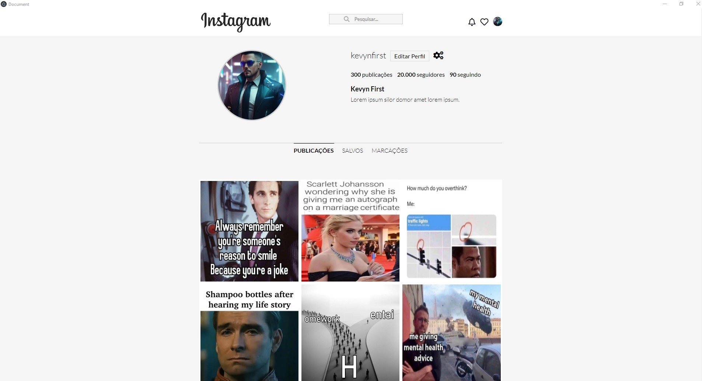

  

Front-end clone do instagram, repassado no curso da Danki Code Front-end completo convertido para app desktop, com eletron.js.

  <a href="#-tecnologias">Tecnologias</a>&nbsp;&nbsp;&nbsp;|&nbsp;&nbsp;&nbsp;
  <a href="#-projeto">Projeto</a>&nbsp;&nbsp;&nbsp;|&nbsp;&nbsp;&nbsp;
  <a href="#-preview">Preview</a>

  

 

## 🚀 Tecnologias
Esse projeto foi desenvolvido com as seguintes tecnologias:
- [HTML5](https://html.com/)
- [CSS3](https://developer.mozilla.org/pt-BR/docs/Web/CSS)
- [Javascript](https://www.javascript.com)
- [Electron.js](https://www.electronjs.org/pt/)
 
 

## 📖 Projeto
Nesse projeto foi desenvolvido Front-end da home page do instagram, repassado no curso da Danki Code Front-end completo. Converti em um app desktop para o sistema operacional Windows em 32bits, com o framework Electronjs. Objetivo desse projeto testar o conhecimento desse framework que tranforma aplicações web feitas com html, css e js em aplicações desktop.
 
 

## 🖥 Preview

  

 Baixe a pasta da aplicação <a href="https://drive.google.com/file/d/1MDtvewKIPvsoOSZYmn4viONGCdFBWqfA/view?usp=sharing" target="_blank">aqui</a> 👈  
depois extraia o arquivo e execute dentro da pasta o <i>insta eletron.exe</i>.

 

## 😉 Obrigado por visitar meu projeto

Você pode conferir outros projetos que desenvolvi aqui no meu GitHub, ou entrar em contato comigo pelos demais links.

